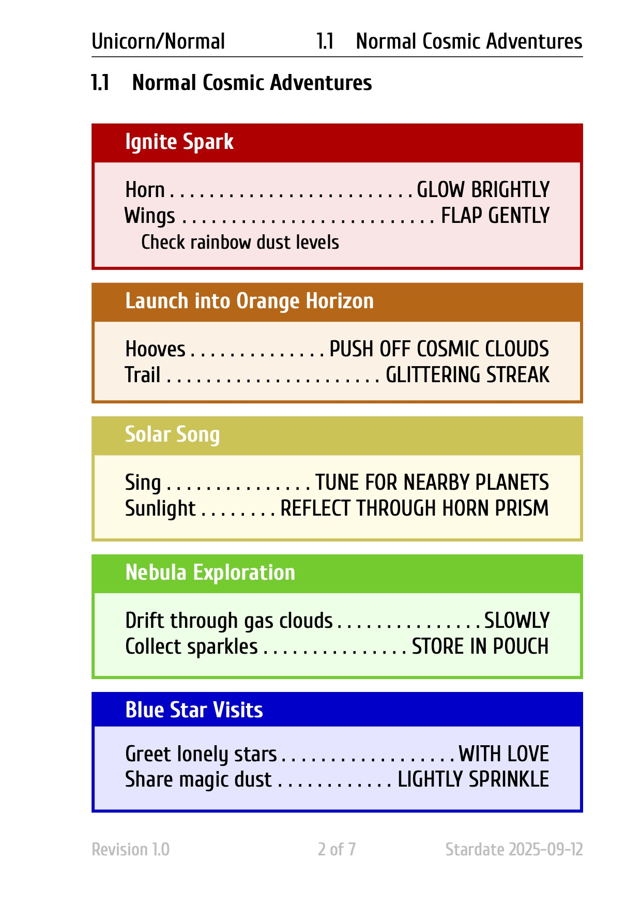

# checklists — Aviation Checklist Management Toolkit

Welcome to **checklists** — a modular toolkit for version-controlled, professional aviation checklists. Author, manage, and share checklists in **YAML**, render beautiful PDFs with LaTeX, and sync with ForeFlight using `.fmd` files. Author your checklist once—use everywhere.

---

## 🚀 Features

| Feature         | Description                                                                                                                            |
|-----------------|----------------------------------------------------------------------------------------------------------------------------------------|
| **YAML Source** | Author, edit, and version-control checklists in clear, human-editable YAML ([spec](docs/format-yaml.md))                               |
| **LaTeX Output**| Render structured, print-ready PDFs using the `checklist.cls` class ([docs](docs/latex-class.md)) — use standalone or with this module |
| **ForeFlight**  | Import/export ForeFlight `.fmd` files (encrypted, syncable format) ([spec](docs/format-fmd.md))                                        |
| **CLI Utility** | Command-line interface for conversion, rendering, and automation ([see manpage](docs/cli-manpage.md))                                  |

---

## 📝 Usage Modes

You can use this toolkit in two main ways:

### 1. Use the LaTeX Class Standalone

- Write your own TeX documents and utilize [`checklist.cls`](docs/latex-class.md) for professional, structured checklists.
- All LaTeX features and styling are available without the Python module.

### 2. Use the Python Module & CLI Workflow

- Author your checklist in YAML.
- Convert to LaTeX, ForeFlight `.fmd`, or back with the Python CLI utility.
- Automate PDF generation and ForeFlight sync for cockpit and mobile use.

---

## 🛠️ How to Install

**Requirements:**

- Python 3.8+
- [LaTeX environment](https://www.latex-project.org/get/) (for PDF rendering; `xelatex` recommended)
- [ttfutils](https://pypi.org/project/ttfutils/) if using custom fonts

**Install via pip (editable mode recommended for development):**
```bash
git clone https://github.com/miss-sophie/checklists.git
cd checklists/checklist
pip install -e .
```

Or install directly:
```bash
pip install .
```

**Install dependencies only:**
```bash
pip install -r requirements.txt
```

---

## ⚡ Quickstart

**Basic CLI usage:**
```bash
# Convert ForeFlight .fmd to YAML
checklist import-fmd input.fmd output.yaml

# Export YAML to ForeFlight .fmd
checklist export-fmd input.yaml output.fmd

# Render LaTeX .tex from YAML (then compile to PDF)
checklist render-latex input.yaml output.tex --papersize a4double --use-sections
xelatex -output-directory=build output.tex
```

See the [CLI manpage](docs/cli-manpage.md) for full CLI documentation, options, and examples.

---

## 📝 Example TeX Document

```latex
\documentclass[a4double,legal_disclaimer]{checklist}

\checklistName{Diamond DA20-A1 Checklist}
\checklistDescription{Normal, Abnormal, Emergency}
\checklistRevision{1.0}
\checklistDateIssue{2025-09-12}
\checklistLogo{logo.pdf}

\begin{document}
\maketitle

\normalchapter
\section{Preflight}
\begin{checklist}{Exterior Inspection}[colback=blue!5,colframe=black]
  \checkitem{Aircraft Papers}{CHECKED}
  \checkitem{Fuel}{CHECK}
  \notes{Drain fuel samples from both tanks}
\end{checklist}

\end{document}
```



---

## 📚 Documentation

- **CLI Reference / Manpage:** [docs/cli-manpage.md](docs/cli-manpage.md)
- **YAML Format Spec:** [docs/yaml-format.md](docs/format-yaml.md)
- **ForeFlight .fmd Spec:** [docs/foreflight-format.md](docs/format-fmd.md)
- **LaTeX Class:** [docs/latex-class.md](docs/latex-class.md)